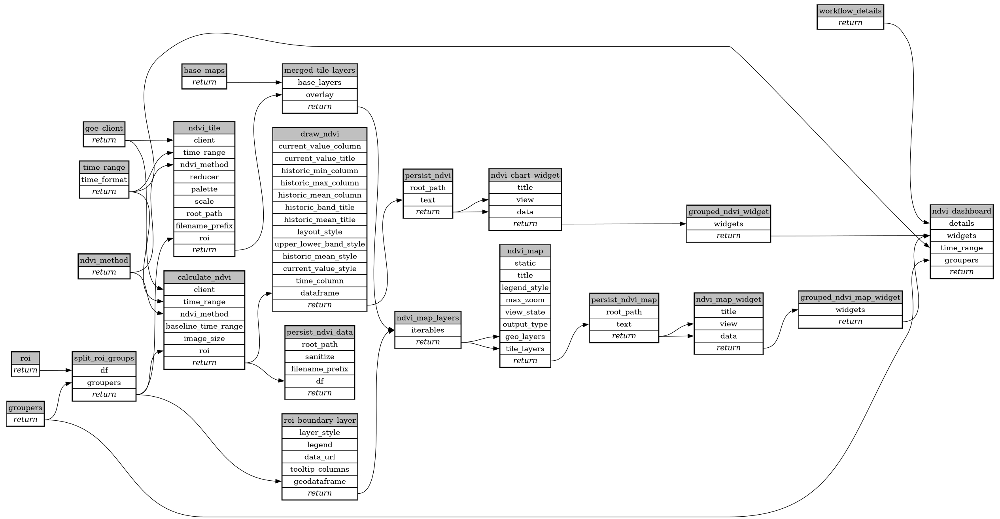

```
# AUTOGENERATED BY ECOSCOPE-WORKFLOWS; see fingerprint in README.md for details

```

```yaml
# fingerprint:
artifacts_sha256_basic: 7d9d8f6bd7b006f7a46035b7b8d612157d9e3402a90dd645d0cc42ebc7b3db90
artifacts_sha256_strict: 4b53e586b3b5ac685bb9e6dfbb20f0a41a794b214a9856d032a519ed6efe7287
installed_requirements:
- channel: https://repo.prefix.dev/ecoscope-workflows/
  name: ecoscope-platform
  version: {version: ==2.16.6}
- channel: https://repo.prefix.dev/ecoscope-workflows-custom/
  name: ecoscope-workflows-ext-custom
  version: {version: ==0.1.0rc20}
- channel: conda-forge
  name: pydeck
  version: {version: ==0.9.2}
params_sha256: 9e22810e6c60158ce774c9213d40e773086e6c57ab3b709422ea03ee87475080
spec_sha256: e7c6c0f9c66adce234a8845f16d9681b02f9cf4c63c445939fcb097ceabf728b

```

# ecoscope-workflows-ndvi-workflow


